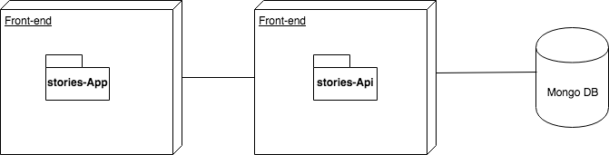
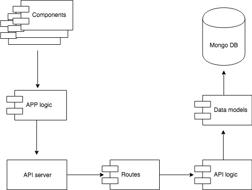
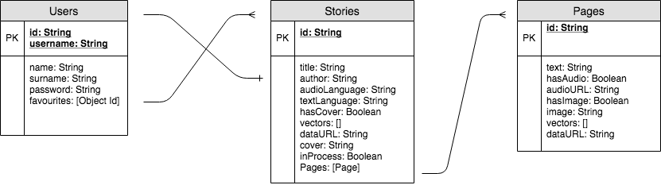
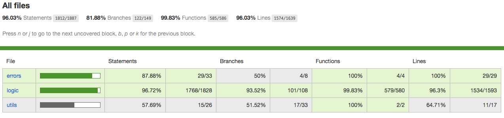
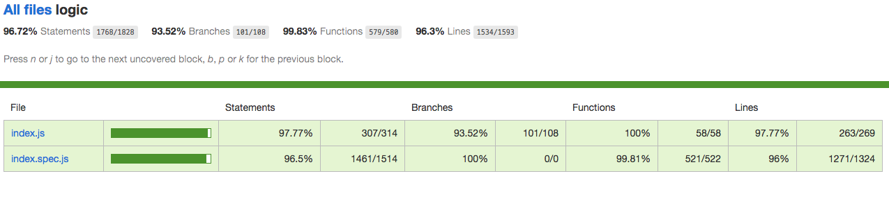

# Once Uppon a Tale App

## Intro

This web application is oriented to children. The goal of the app is to allow the user to create his own tale, with draws, audios and texts as well as to share it with other children.

## Functional description

In Once Upon a Tale the registered user is able to create his own stories. Drawing the cover and pages and recording audio and writing brief text for each page. 

From his stories page the user can update each tale or can read them. When reading, the audio is displayed at the same time as the user is able to read the text and watch the image of that page. 

When updating the tale, the user can decide to share his tale. If the tale is shared then other users will be able to find it from the search page by entering a query that matches with the title. By clicking on the cover of a tale the the user will be able to begin to read, watch and listen that story. From that page the user has the possibility to tag the tale as favourite or take out that category. Once the user has tagged a story as favourite, he will find it in his favourites page.

### Use Cases diagram

## Technical description

Once Upon a Tale is designed as a desktop application, and as a web application it should be runned in a browser. It's created using React.js in the front-end, Express and node.js in the back-end and mongoose to interact with Mongo DataBase.

The app is written in javascript language, using some features of javascript ES6 and ESNext. It also uses SessionStorage to maintain the user logged even a reload occurs by keeping userId and token. 

The design is implemented using CSS, SASS, the SweetAlert2 library and react-tooltip.

### Block diagram

### Components diagram

### Data Model diagram

### Test Coverage

